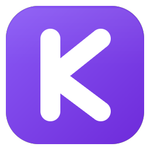
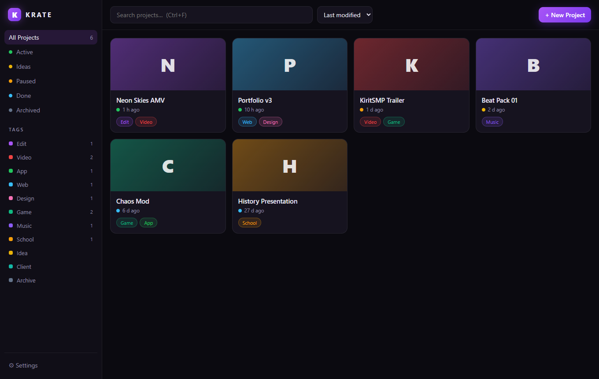
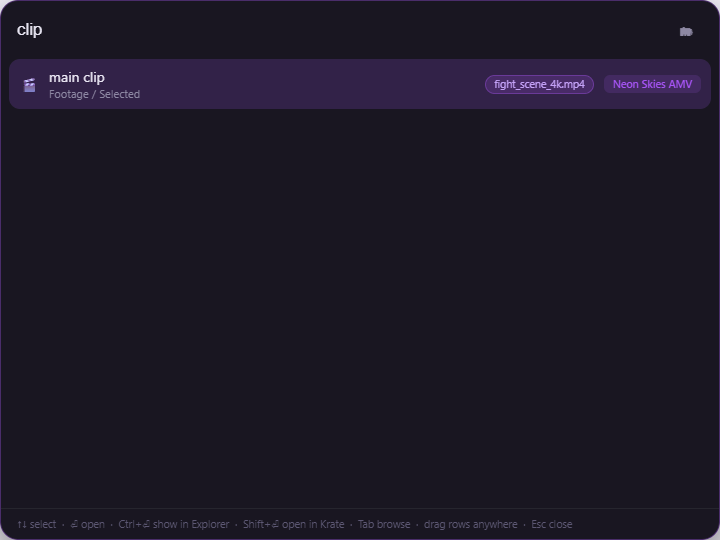
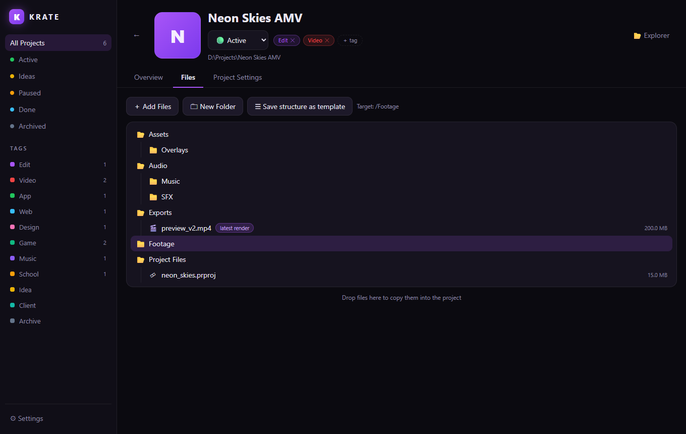

<div align="center">



# Krate

**Every project, packed and findable.**

A local-first project organizer for Windows — tag your projects, template their
folder structure, nickname the files that matter, and pull any of them up
from anywhere with one hotkey.

[](https://github.com/ImKirit/Krate/releases/latest)
[](LICENSE)
[](https://imkirit.dev/krate)



</div>

---

## Why?

Started as a tool for organizing video edits — footage, SFX, project files and
renders scattered everywhere, never findable when you need them. Krate grew
into a general project organizer: **every project is a normal folder on your
disk**, plus a small `krate.json` that Krate uses to store its metadata.
No database, no cloud, no lock-in. Delete Krate and your files are exactly
where they always were.

## Features

📦 **Projects as folders** — pick a default projects folder once; every new
project lives there (or anywhere else you choose per project). Projects found
on disk are picked up automatically.

🏷 **Tags** — preset tags (Edit, Video, App, Web, Design, …) plus your own
custom tags with custom colors. Filter your library by tag or by status
(Idea / Active / Paused / Done / Archived).

🗂 **Folder templates** — define a folder structure once ("Video Edit" ships
with `Footage/Raw`, `Audio/SFX`, `Exports`, …), apply it when creating a
project. You can also save any existing project's structure as a new template.

📝 **Descriptions & notes** — a description plus timestamped notes/comments
per project, stored right in the project folder.

🖼 **Covers** — give each project a cover image and accent color so the
library is scannable at a glance.

✎ **File nicknames** — name a file what it *is* ("main clip", "the track",
"final render") instead of what it's called (`render_v7_FINAL2.mp4`).

⚡ **Quick-search overlay** — press the global hotkey (default `Ctrl+Alt+K`)
anywhere in Windows and search all projects, files and nicknames at once —
or flip into browse mode (`Tab`) and arrow-key through the folder structure.

<div align="center">

</div>

🖱 **Drag & drop both ways** — drop files onto Krate to copy them into a
project; drag results out of the overlay straight into Premiere, Discord,
your browser, anywhere.

🔎 More: fuzzy search, open/reveal in Explorer, tray icon, single-instance,
projects are portable between machines.

<div align="center">

</div>

## Install

Grab the installer from **[Releases](https://github.com/ImKirit/Krate/releases/latest)** and run it.

Or run from source:

```bash
git clone https://github.com/ImKirit/Krate.git
cd Krate
npm install
npm start
```

## Quick-search overlay keys

| Key | Action |
| --- | --- |
| `Ctrl+Alt+K` | Open / close the overlay (configurable in Settings) |
| `↑` `↓` | Select result |
| `Enter` | Open file / enter folder |
| `Ctrl+Enter` | Show in Explorer |
| `Shift+Enter` | Open in the Krate main window |
| `Tab` | Toggle search ⇄ browse mode |
| `←` / `Backspace` | Up one folder (browse mode) |
| `Esc` | Close |
| Drag a row | Drop the file anywhere |

## How data is stored

```
MyProject/
├─ krate.json        ← title, tags, notes, nicknames, status …
├─ .krate/           ← cover image
└─ …your files, exactly as you put them
```

Global settings (default projects folder, tags, templates, hotkey) live in
`%APPDATA%/krate/config.json`.

## Development

```bash
npm start          # run the app
npm run smoke      # headless startup check
npm run icon       # regenerate build/icon.{png,ico}
npm run dist       # build the NSIS installer into dist/
node scripts/screenshot.js   # re-render the README screenshots (via npx electron)
```

Plain Electron, zero runtime dependencies, no build step. `src/main` is the
main process (store, search indexer, windows, IPC), `src/renderer` the main
window UI, `src/overlay` the quick-search overlay.

## License

[MIT](LICENSE) © ImKirit
